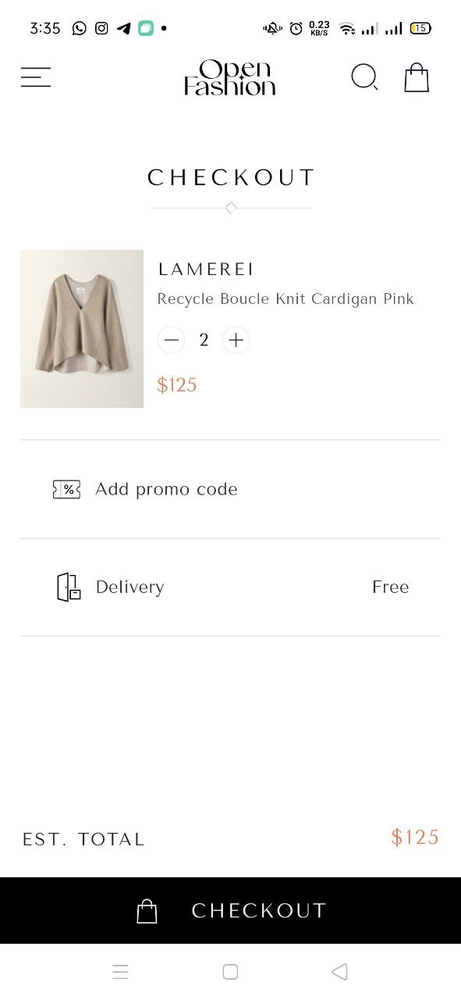
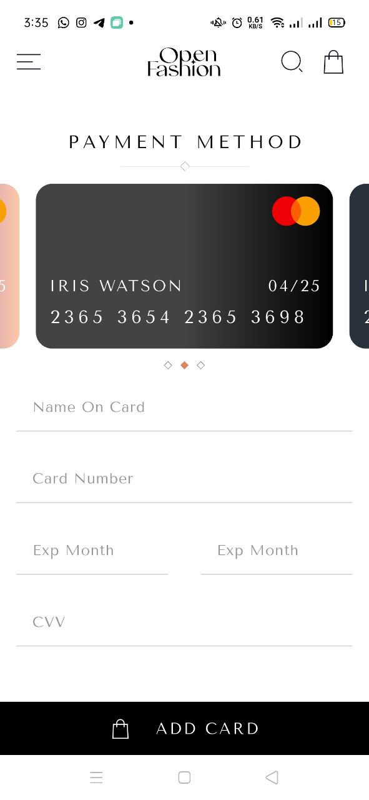
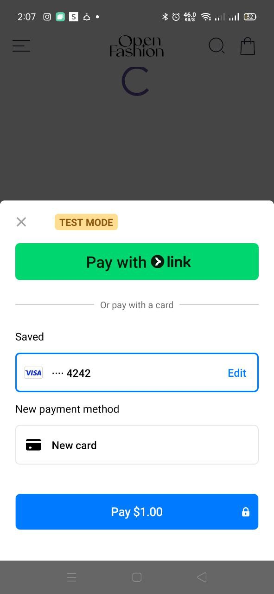
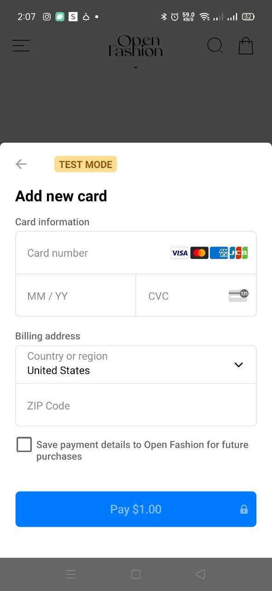
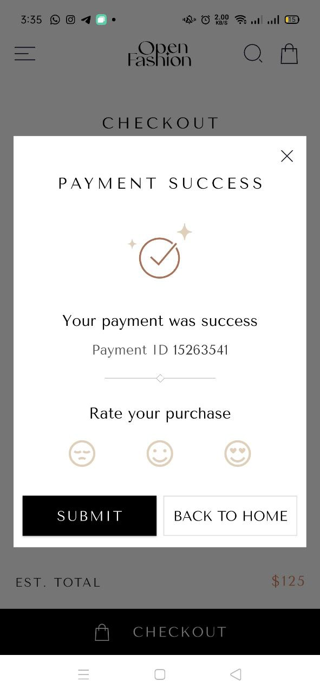

# 🛍️ Checkout App UI - Open Fashion(Payment Getway)

This is a modern and elegant **Flutter checkout screen UI** built for an e-commerce fashion app. It includes clean, responsive design elements like:

- Custom AppBar
- Payment method card swiper
- Card input form (Name, Card Number, Expiry Date, CVV)
- Checkout button
- Payment success screen with rating

---

## 📸 Screenshots

| Checkout Screen | Add New Card Screen | Payment Method(Stripe/Paypal) | Payment Success Screen |
|-----------------|------------------------|
### Checkout Page

where the user reviews their selected items, sees the total price, and proceeds to payment.

### Add New Card Page

user to securely add a new credit or debit card for payment.

### Payment Method(Stripe) Page
 
This screen displays available payment cards via Stripe and allows users to select or add a new card before confirming payment.

### Payment Method(Paypal) Page
 
who prefer to pay using PayPal, providing a familiar and secure checkout experience.

### Payment Success Page

after a successful transaction, assuring the user that their payment was completed.

---

## 🚧 Features

✅ UI Implementation  
- [ ] Stripe Payment Integration
- [ ] PayPal Payment Integration
- [ ] Form Validation

---

## 💳 Planned Payment Gateways

- [Stripe](https://stripe.com/)
- [PayPal](https://paypal.com/)

Using Flutter packages:
- `flutter_stripe`
- `paypal_sdk` or API integration

---

## 📂 Project Structure

```
lib/
│
├── core/
│   ├── styles/
│   └── widgets/
│
├── features/
│   └── checkout/
│       ├── data/
│       ├── domain/
│       └── presentation/
│           ├── views/
│           └── widgets/
│
└── main.dart
```

---

## 🚀 Getting Started

```bash
flutter pub get
flutter run
```

---

## 👨‍💻 Author

- **Marawan Sherif**
- Flutter Developer | Clean Architecture | Firebase | UI/UX

---

## 📌 License

This project is licensed under the MIT License - feel free to use it and build on top!
